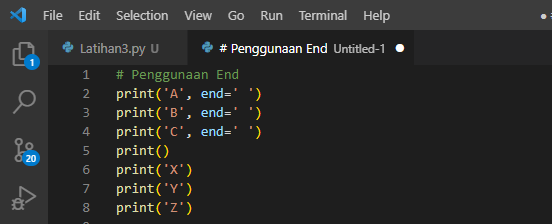
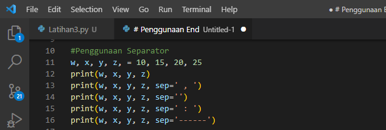
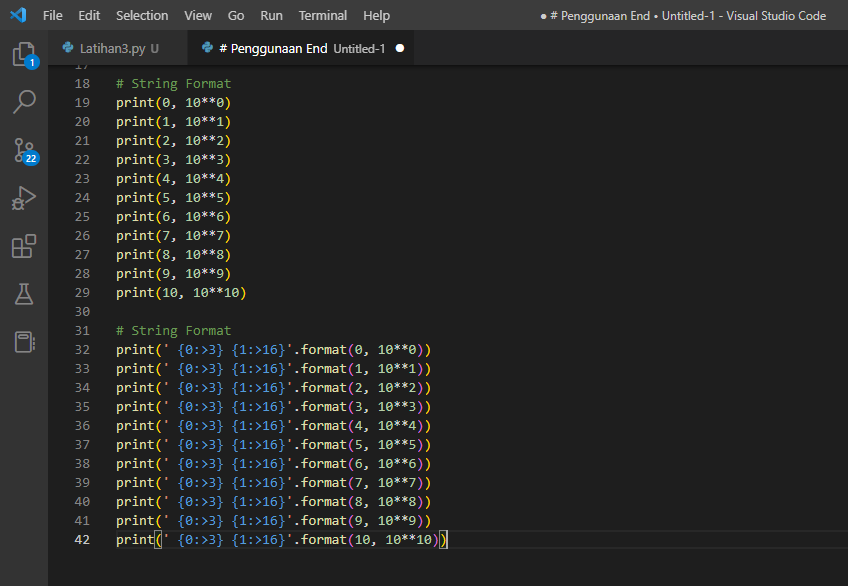
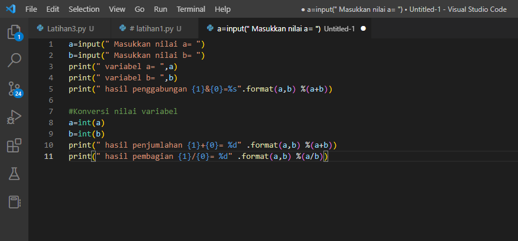
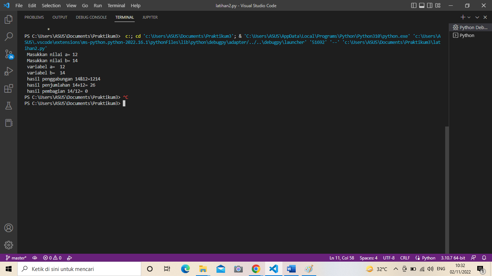
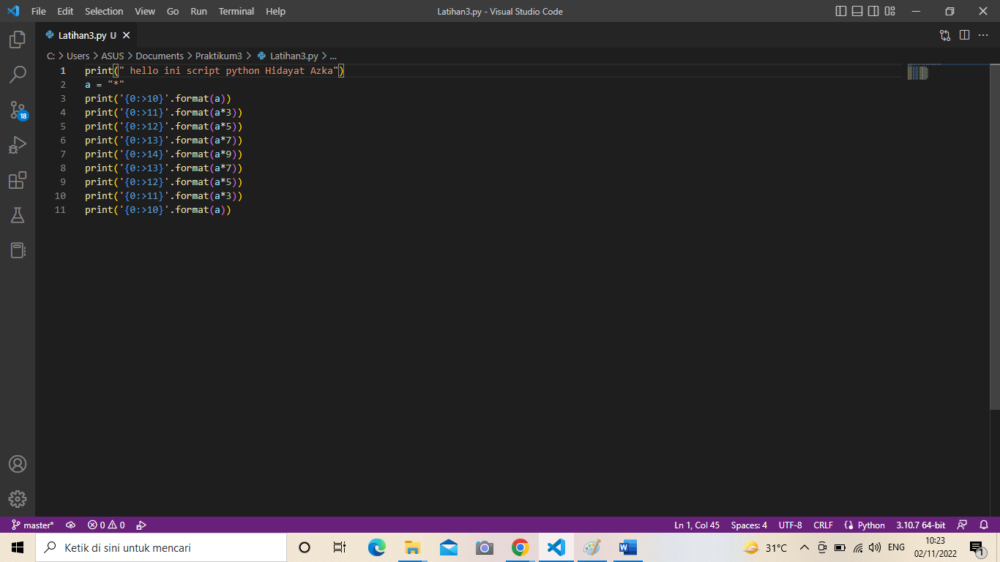
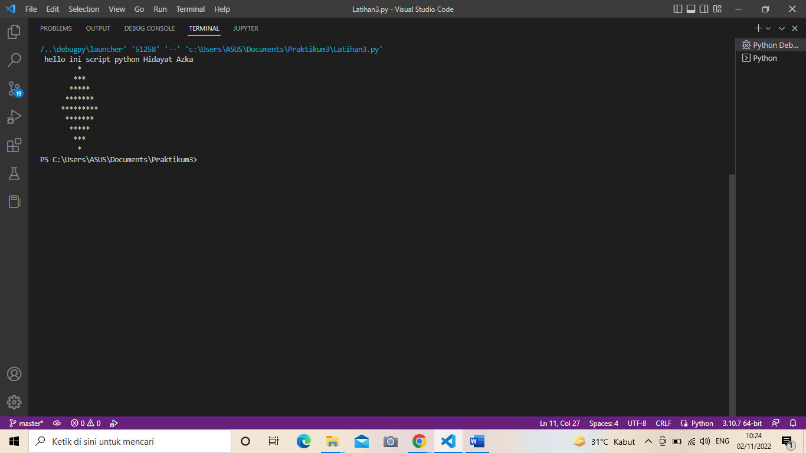
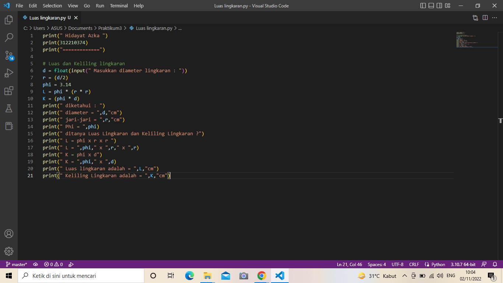
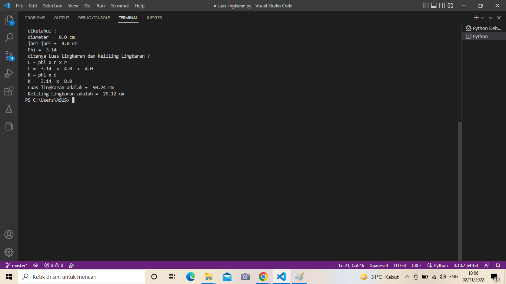

# Parameter END
 end berfungsi untuk mengganti karakter terakhir bawaan yang dicetak di layar. jadi, setiap memanggil fungsi print() untuk mencetak sesuatu, python akan mencetak karakter ganti baris disetiap output.

# Separator
Ketika memanggil fungsi print() untuk menampilkan multi argument, python akan otomatis menambahkan karakter spasi pemisah antar argumen tersebut. jika tidak ingin pemisah spasi, maka bisa menambahkan parameter separator saat memanggil fungsi print()

# String Format
Fungsi format() berfungsi untuk melakukan pengaturan format string yang akan dicetak atau ditampilkan ke monitor.
-contohnya adalah sebagai berikut :

# Latihan2
Input dan Output variabel a dan b
Membuat variabel a dan b dan mengisikan variabel tersebut value type class string. Lalu menggabungkan, menambahkan dan membagikannya menggunakan string formatting.

- membuat variabel a,b dan input value variabel a,b
- format hasil penggabungan
- format hasil penjumlahan
- format hasil pembagian
- contohnya adalah sebagai berikut :

- hasil dari program yang sudah dijalankan :

# Latihan3
String Formatting membuat pola bintang ketupat
Fungsi format untuk melakukan pengaturan format string yang akan dicetak atau ditampilkan ke monitor sesuai dengan format yang telah dibuat.

Buat variabel a dan isi variabel tersebut dengan bintang (*)
Type class pada variabel a akan menjadi type string
Membuat program string format {0:>10-14} yang artinya value 0 akan berada diposisi yang lebih besar dari 10 sampai 14. format {1,3,5,7,9} artinya variabel a yang berisi ()akan di kalikan 1.3,5,7,9 di masing-masing fromat yang akan dibuat. variabel a tersebut akan dimasukkan kedalam format {0:>10-14}, jadi posisi variabel a akan berada diposisi value tersebut
contohnya adalah sebagai berikut :

hasil dari program yang sudah dijalankan :

# Menghitung Luas dan Keliling Lingkaran
Menghitung Luas Lingkaran dan Keliling Lingkaran
Masukkan nilai jari-jari
Menghitung proses Luas = phi * (r*r)
Menghitung proses Keliling = 2 * phi * r
program dari menghitung luas dan keliling lingkaran adalah sebagai berikut :

hasil dari program yang sudah dijalankan :

